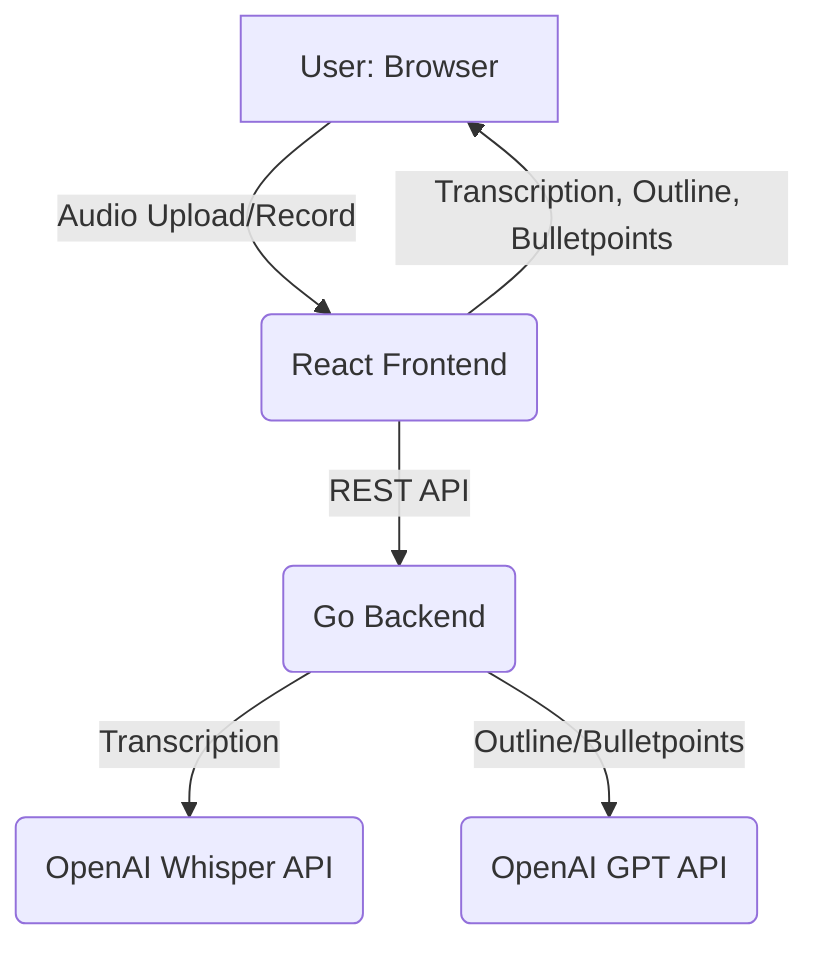

# TalkTailor

[](LICENSE)

**TalkTailor** is an open-source, AI-powered web application for transcribing, analyzing, and improving your talks or speeches. It features a modern React frontend and a robust Go backend, leveraging OpenAI's Whisper and GPT models for fast, accurate transcription and advanced text analysis.

---

## Features

- 🎙️ **Record or Upload Audio:** Record directly in your browser or upload MP3/video files.
- ✨ **AI-Powered Transcription:** Uses OpenAI Whisper for high-quality, multi-language transcription.
- 📝 **Text Correction:** Automatic grammar and formatting correction of transcriptions.
- 🧠 **Outline & Bulletpoints:** Instantly generate speaker outlines and bulletpoints from your transcript using GPT-4.
- 💾 **Local Storage:** Stores your recent transcriptions and audio securely in your browser.
- 📋 **Copy & Edit:** Edit, copy, and manage your transcripts with ease.
- 🚀 **Modern UI:** Built with React and Ant Design for a seamless user experience.
- 🐳 **Docker Support:** Easy deployment with Docker.

---

## Architecture



---

## Demo

1. **Record or Upload:** Start a new recording or upload an audio/video file.
2. **Transcribe:** Let the AI transcribe and correct your speech.
3. **Analyze:** Generate outlines or bulletpoints for your talk.
4. **Edit & Copy:** Refine and copy your transcript for further use.

---

## Getting Started

### Prerequisites

- [Go](https://golang.org/) 1.20+
- [Node.js](https://nodejs.org/) 18+
- [npm](https://www.npmjs.com/) or [yarn](https://yarnpkg.com/)
- [Docker](https://www.docker.com/) (optional, for containerized deployment)
- OpenAI API Key ([get one here](https://platform.openai.com/account/api-keys))

### Clone the Repository

```bash
git clone https://github.com/yourusername/talktailor.git
cd talktailor
```

---

## Local Development

### 1. Backend (Go)

Set your OpenAI API key:

```bash
export OPENAI_API_KEY=your-openai-key
```

Install dependencies and run the server:

```bash
go mod tidy
go run main.go
```

The backend will serve the frontend and expose API endpoints at `http://localhost:8080`.

### 2. Frontend (React)

```bash
cd client
npm install
npm run build
```

The production build will be placed in `client/dist` and served by the Go backend.

---

## Docker Usage

Build and run the application using Docker:

```bash
docker build -t talktailor .
docker run -e OPENAI_API_KEY=your-openai-key -p 8080:8080 talktailor
```

---

## API Reference

### `POST /api/transcribe`

- **Description:** Upload an audio file (MP3 or video) to receive a transcription.
- **Request:** `multipart/form-data` with `audio` file field.
- **Response:** JSON with original and corrected transcription.

### `POST /api/outline`

- **Description:** Generate a detailed speaker outline from transcript text.
- **Request:** JSON `{ "text": "..." }`
- **Response:** JSON `{ "response": "..." }`

### `POST /api/bulletpoints`

- **Description:** Convert transcript text into bulletpoints.
- **Request:** JSON `{ "text": "..." }`
- **Response:** JSON `{ "response": "..." }`

---

## Configuration

- `OPENAI_API_KEY` (required): Your OpenAI API key for transcription and text analysis.

---

## Contributing

Contributions are welcome! Please open issues or pull requests for bug fixes, features, or improvements.

- Follow standard Go and React/TypeScript best practices.
- Ensure code is well-documented and tested.
- By contributing, you agree to license your work under the MIT License.

---

## Roadmap

The following roadmap outlines possible directions for community-driven development:

### 1. Customizability
- **Custom AI Actions:** Define your own AI-powered actions (e.g., "Summarize for LinkedIn", "Extract Q&A", "Generate Quiz") via prompt templates.
- **Personalized Feedback:** Set personal goals (e.g., pacing, filler word reduction) and receive targeted feedback.
- **UI Themes & Layouts:** Dark mode, font size, and customizable dashboard widgets.
- **Language & Region Settings:** Multi-language UI and locale-aware formatting.

### 2. Advanced AI Enhancements
- **Speech Analytics:** Detect filler words, pacing, pauses, and provide visual analytics. Sentiment/emotion analysis of speech.
- **Speaker Coaching:** AI-generated tips based on transcript analysis (clarity, engagement). Simulated audience Q&A and answer quality rating.
- **Custom Model Integration:** Plug in your own OpenAI-compatible models or endpoints. Support for fine-tuned models for specific domains.

### 3. Training & Practice Tools
- **Practice Mode:** Timed speaking exercises with real-time feedback.
- **Progress Tracking:** Visualize improvement over time (charts, badges, milestones).
- **Peer Review:** Share recordings/transcripts for community or mentor feedback.
- **Scenario Library:** Pre-built scenarios (e.g., job interview, TED talk) with tailored feedback.

### 4. Collaboration & Sharing
- **Team Workspaces:** Shared libraries for teams, clubs, or classes.
- **Export Options:** Export to PDF, DOCX, slides, or share via link.
- **API & Plugin System:** Third-party integrations (calendar, LMS, video platforms).

### 5. Privacy & Data Control
- **On-Premise/Private Mode:** Option to run all processing locally or on self-hosted infrastructure.
- **Granular Data Controls:** User control over data retention, sharing, and deletion.

---

## License

This project is licensed under the [MIT License](LICENSE).

---

## Acknowledgements

- [OpenAI Whisper](https://platform.openai.com/docs/guides/speech-to-text)
- [OpenAI GPT](https://platform.openai.com/docs/guides/gpt)
- [Gin Web Framework](https://gin-gonic.com/)
- [Ant Design](https://ant.design/)
